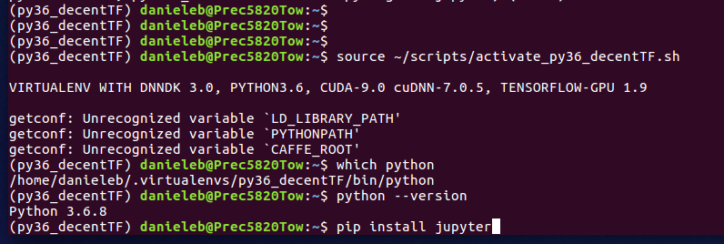
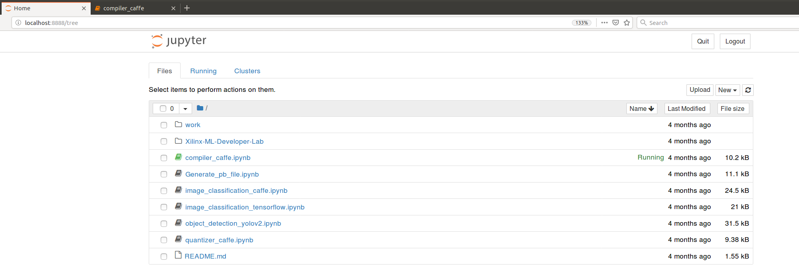

# Appendix

## A1: Jupiter NoteBook

Jupyter Notebooks can work only with Python3.5 and beyond. The starting point can be found in this [Jupyter Notebook quickstart](https://jupyter.readthedocs.io/en/latest/content-quickstart.html).
Personally, not being an Anaconda user, I have installed it in my Python3.6 Virtual Environment with the following commands:
```
source ~/scripts/activate_py36_decentTF.sh # to launch the Python3.6 virtual environment shell script, placed in ~/scripts/
pip install jupyter
jupyter notebook
```
as illustrated in the following screenshot:


Then you can launch the jupiter notebook server and interact with it with your browser pointing to the default URL ```http://localhost:8888```
as illustrated in the following screenshot (related to the notebooks of [Xilinx ML Suite v1.3](https://github.com/Xilinx/ml-suite))


Alternatively you can set a different port - i.e. ```9999``` - with the command ```jupyter notebook --port 9999```.
