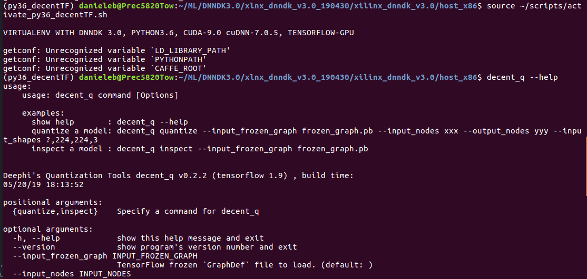
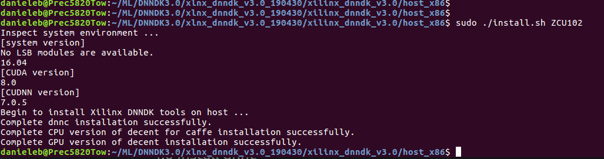

# How to install TensorFlow based DNNDK3.0 with Python Virtual Environments

Despite what written in [UG1327](https://www.xilinx.com/support/documentation/user_guides/ug1327-dnndk-user-guide.pdf), you do not need [anaconda3](https://www.anaconda.com/) to install the DNNDK 3.0 TensorFlow toolchain (shortly "DNNDK TF 3.0" in the following), you can just rely on **Python Virtual Environments**, thus having a much simpler and more clean installation procedure.

## 0. Prerequisites

1. This tutorial assumes you are using a PC mounting **Ubuntu 16.04 Linux OS** with Python [virtual environments](https://docs.python-guide.org/dev/virtualenvs) (by default Ubuntu 16.04 comes with Python 2.7 and 3.5, shortly named ``python`` -or ``python2``- and ``python3``, have in mind that Python 2.7 will be deprecated at the end of year 2019  ). An excellent explanation about setting up a python virtual environment can be found in the  ["Ubuntu 16.04: How to install OpenCV" install tutorial by PyImageSearch](https://www.pyimagesearch.com/2016/10/24/ubuntu-16-04-how-to-install-opencv/), which deals about installing OpenCV 3.4 from scratch on a Python3.5 Virtual Environment. Exactly the same procedure can be adopted to install **Python3.6**, which is mandatory for the correct working of Xilinx DNNDK TF 3.0, unless you want to use the "old" .

2. Your PC "should have" a CUDA-compatible GPU card and the following libraries: CUDA 8.0 or 9.0, and cuDNN 7.0.5. Alternatively, you can use a **p2.xlarge EC2** instance of Deep Learning Base AMI Ubuntu (version 15 or beyond) from **AWS**.  Many of the Ubuntu packages required by ML tools are already required by Xilinx [SDx tools](https://www.xilinx.com/support/documentation/sw_manuals/xilinx2018_1/ug1238-sdx-rnil.pdf) as well, so you would have to install them anyway. Note that the DNNDK TF 3.0 tools can also work with CPU only, without any CUDA-compatible GPU, of course at detriment of simulation speed.

3. [Xilinx DNNDK TF 3.0](https://www.xilinx.com/member/forms/download/dnndk-eula-xef.html?filename=xlnx_dnndk_v3.0_190430.tar.gz) release and related [UG1327](https://www.xilinx.com/support/documentation/user_guides/ug1327-dnndk-user-guide.pdf) available from [Xilixn Edge AI Resources](https://www.xilinx.com/products/design-tools/ai-inference/ai-developer-hub.html#edge) webpage. Once downloaded it and stored into your ```$HOME``` directory execute the following commands:
```
cd $HOME
mkdir ML
mkdir DNNDK3.0
cd $HOME/ML/DNNDK3.0
mv $HOME/xlnx_dnndk_v3.0_190430.tar.gz .
tar -xvf xlnx_dnndk_v3.0_190430.tar.gz
cd xlnx_dnndk_v3.0_190430
cd xilinx_dnndk_v3.0
ls $HOME/ML/DNNDK3.0/xlnx_dnndk_v3.0_190430/xilinx_dnndk_v3.0/host_x86/decent-tf/ubuntu16.04/tensorflow_gpu-1.9.0-cp27-cp27mu-linux_x86_64.whl # package for Python2.7
ls $HOME/ML/DNNDK3.0/xlnx_dnndk_v3.0_190430/xilinx_dnndk_v3.0/host_x86/decent-tf/ubuntu16.04/tensorflow_gpu-1.9.0-cp36-cp36m-linux_x86_64.whl  # package for Python3.6
```

4. <a href="https://www.xilinx.com/products/boards-and-kits/ek-u1-zcu102-g.html">ZCU102</a> target board and related [DNNDK 3.0 image file](https://www.xilinx.com/member/forms/download/zcu102-image-license-xef.html?filename=xilinx-zcu102-prod-dpu1.4-2018.3-desktop-buster-2019-04-24.img.zip).


## 1.0 Install Dependent Libraries

```
sudo apt-get update
sudo apt-get upgrade

sudo apt-get install -y --force-yes build-essential autoconf libtool libopenblas-dev libgflags-dev libgoogle-glog-dev libopencv-dev protobuf-compiler libleveldb-dev liblmdb-dev libhdf5-dev libsnappy-dev libboost-all-dev libssl-dev

sudo apt-get install cmake unzip pkg-config libjpeg-dev libtiff-dev libjasper-dev libpng-devx libgtk-3-dev libavcodec-dev libavformat-dev libswscale-dev libv4l-dev libxvidcore-dev libx264-dev libatlas-base-dev gfortran

sudo apt-get install python3.5-dev

sudo add-apt-repository ppa:jonathonf/python-3.6
sudo apt-get install python3.6
sudo apt-get install python3.6-dev
```
Edit your ```$HOME/.bashrc``` hidden file by adding in the bottom the following lines:
```
# MACHINE LEARNING: reset variables
PATH=$(getconf PATH)
LD_LIBRARY_PATH=$(getconf LD_LIBRARY_PATH)
PYTHONPATH=$(getconf PYTHONPATH)
CAFFE_ROOT=$(getconf CAFFE_ROOT)

#NVIDIA CUDA 8.0 Toolkit
export PATH=/usr/local/cuda-8.0/bin:$PATH
export LD_LIBRARY_PATH=/usr/local/cuda-8.0/lib64/:$LD_LIBRARY_PATH

#Xilinx DNNDK
export LD_LIBRARY_PATH=/usr/local/lib:$LD_LIBRARY_PATH
export PATH=/usr/local/bin/:$PATH
```


## 2.0 Install decent on Python 3.6 Virtual Environment

Now run the following commands:

```
wget https://bootstrap.pypa.io/get-pip.py
sudo python3.6 get-pip.py
sudo pip install virtualenv virtualenvwrapper
sudo rm -rf ~/get-pip.py ~/.cache/pip

source $HOME/.bashrc
export WORKON_HOME=$HOME/.virtualenvs
export VIRTUALENVWRAPPER_PYTHON=/usr/bin/python3
source /usr/local/bin/virtualenvwrapper.sh

# create the virtual env named "py36_decentTF"
mkvirtualenv py36_decentTF -p python3.6

workon py36_decentTF

#install the DNNDK TF 3.0 wheel
pip install $HOME/ML/DNNDK3.0/xlnx_dnndk_v3.0_190430/xilinx_dnndk_v3.0/host_x86/decent-tf/ubuntu16.04/tensorflow_gpu-1.9.0-cp36-cp36m-linux_x86_64.whl

#install other libraries required by DNNDK TF 3.0
pip install numpy opencv-python sklearn scipy progressbar2
pip install keras
pip install google
pip install protobuf

# check the just-installed tool
decent_q --help
```
You should see something similar to what illustrated in the following screenshot:


To have a simpler life it is strongly recommended that you create a shell script file named ```activate_py36_decentTF.sh``` like this
```
#!/bin/sh

echo ""
echo "VIRTUALENV WITH DNNDK 3.0, PYTHON3.6, CUDA-9.0 cuDNN-7.0.5, TENSORFLOW-GPU 1.9"
echo ""

source ~/.bashrc

# virtualenv for python3.6
export WORKON_HOME=$HOME/.virtualenvs
export VIRTUALENVWRAPPER_PYTHON=/usr/bin/python
export VIRTUALENVWRAPPER_VIRTUALENV=/usr/local/bin/virtualenv
source /usr/local/bin/virtualenvwrapper.sh
export PYTHONPATH=/usr/local/lib/python3.6/dist-packages:$PYTHONPATH

#NVIDIA CUDA 9.0 and 8.0 Toolkits
export PATH=/usr/local/cuda-9.0/bin:$PATH
export LD_LIBRARY_PATH=/usr/local/cuda-9.0/lib64/:$LD_LIBRARY_PATH
export LD_LIBRARY_PATH=/usr/local/lib/:$LD_LIBRARY_PATH
export PATH=/usr/local/bin/:$PATH

export PATH=/usr/local/cuda-8.0/bin:$PATH
export LD_LIBRARY_PATH=/usr/local/cuda-8.0/lib64/:$LD_LIBRARY_PATH

# enter the virtualenv
workon py36_decentTF
```
and launch it any time you need to work on your ```py36_decentTF``` virtual environment.

## 3.0 Install decent on Python 2.7 Virtual Environment

Alternatively to Python3.6 you can go on in using the "old" Python2.7 with the following commands:

```
wget https://bootstrap.pypa.io/get-pip.py
sudo python2.7 get-pip.py
sudo pip install virtualenv virtualenvwrapper
sudo rm -rf ~/get-pip.py ~/.cache/pip

source $HOME/.bashrc
export WORKON_HOME=$HOME/.virtualenvs
export VIRTUALENVWRAPPER_PYTHON=/usr/bin/python2.7
source /usr/local/bin/virtualenvwrapper.sh

# create the virtual env named "decentTF"
mkvirtualenv decentTF -p python2.7

workon decentTF

install the DNNDK TF 3.0 wheel
pip install $HOME/ML/DNNDK3.0/xlnx_dnndk_v3.0_190430/xilinx_dnndk_v3.0/host_x86/decent-tf/ubuntu16.04/tensorflow_gpu-1.9.0-cp27-cp27-linux_x86_64.whl

#install other libraries required by DNNDK TF 3.0
pip install numpy opencv-python sklearn scipy progressbar2
pip install keras
pip install google
pip install protobuf

# check the just-installed tool
decent_q --help
```

To have a simpler life it is strongly recommended that you create a shell script file named ```activate_decentTF.sh``` like this:
```
#!/bin/sh

echo ""
echo "VIRTUALENV WITH DNNDK 3.0, PYTHON2.7, CUDA-8.0 cuDNN-7.0.5, TENSORFLOW-GPU 1.9"
echo ""

source ~/.bashrc

# virtualenv for python2.7
export WORKON_HOME=$HOME/.virtualenvs
export VIRTUALENVWRAPPER_PYTHON=/usr/bin/python
export VIRTUALENVWRAPPER_VIRTUALENV=/usr/local/bin/virtualenv
source /usr/local/bin/virtualenvwrapper.sh
export PYTHONPATH=/usr/local/lib/python2.7/dist-packages:$PYTHONPATH

#NVIDIA CUDA 8.0 Toolkit
export PATH=/usr/local/cuda-8.0/bin:$PATH
export LD_LIBRARY_PATH=/usr/local/cuda-8.0/lib64/:$LD_LIBRARY_PATH
export LD_LIBRARY_PATH=/usr/local/lib/:$LD_LIBRARY_PATH
export PATH=/usr/local/bin/:$PATH

# enter the virtualenv
workon decentTF
```
and launch it any time you need to work on your ```decentTF``` virtual environment.

## 4.0 Install dnnc

To install the **dnnc** (DNNDK CNN compiler) you have to select one of the allowed target boards, for example the <a href="https://www.xilinx.com/products/boards-and-kits/ek-u1-zcu102-g.html">ZCU102</a>. Then execute the following commands:
```
cd $HOME/ML/DNNDK3.0
cd xlnx_dnndk_v3.0_190430
cd xilinx_dnndk_v3.0
cd host_x86
sudo install.sh ZCU102 #it will install the tools on /usr/local/bin/
```

You should see something as illustrated in the following screenshot:



## 5.0 Install the DNNDK libraries on the Target ZCU102 board
